# 100
Diberikan sebuah binary 64 bit bernama `100`. Kita decompile dengan IDA pro dan didalamnya terdapat fungsi `base64_decode`, `unhex`, `eEeee`, 100 fungsi `fFfff`, `prepare`, dan `main`.

Pertama-tama, lihat pseudocode fungsi `main` berikut!

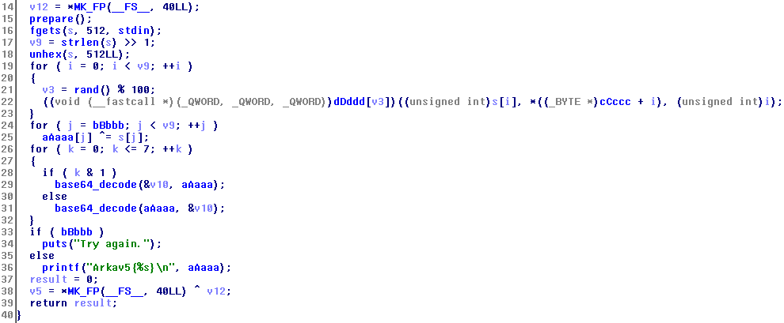

Pada fungsi main line 15, `prepare` akan dipanggil. Fungsi ini akan memberikan seed pada `srand` dan menyimpan address fungsi `fFfff0`-`fFfff99` ke array `dDddd`.

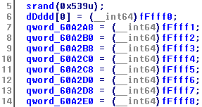

Kemudian pada line 16, program akan meminta input dari user, maksimal sepanjang 511 byte (`fgets`, maks n-1) dan disimpan ke `s`. Lalu panjang string yang kita masukkan akan dihitung dan dibagi 2 (a >> b == a/2**b) dan hasilnya disimpan ke dalam variabel `v9`.

Pada line 18, fungsi `unhex` akan dipanggil. Seperti namanya, fungsi ini akan mengubah hexadesimal yang berbentuk string menjadi integer. Kurang lebih fungsi ini sama seperti int(“string”, 16) pada Python. Berarti, input yang dimasukkan harus string yang berbentuk hexadesimal.

Gambar di bawah merupakan hasil sebelum dan sesudah fungsi `unhex` dipanggil, dimana input berupa string `11223344556677889900aabbccddeeff` yang disimpan di address `0x7fffffffddf0`.

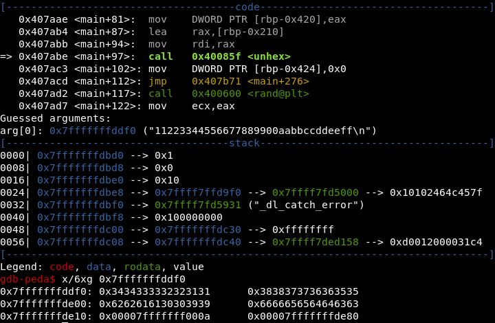


Setelah `unhex` dipanggil, panjang inputan kita menjadi setengahnya pada memori yang sama dengan `v9`.

Selanjutnya, for loop pada line 19-23 salah satu fungsi `fFfff` akan dipanggil melalui array `dDddd` yang indexnya didapat dari fungsi `rand`. Ada tiga argumen yang diberikan ke fungsi ini, yaitu `s[i]`, `cCccc[i]`, dan `i` dimana `i` bernilai 0 sampai kurang dari `v9`. `cCccc` merupakan pointer address `0x407E40`, yang di address tersebut terdapat byte "acak" yang diinisiasi di awal sepanjang 252 byte.

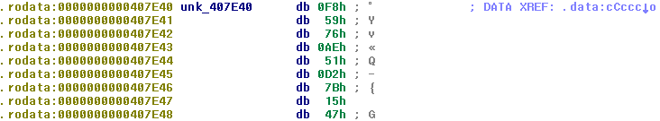

Lalu pada line 24-25, variabel `aAaaa` akan dixor dengan `s` dari index yang senilai dengan `bBbbb` sampai index terakhir. Kemudian `aAaaa` akan diproses dengan `base64_decode`. Terakhir pada line 33-36, `aAaaa` akan diprint jika `bBbbb` bernilai nol. Jadi, `aAaaa` merupakan variabel yang menyimpan flag. Jika dilihat dengan xref, variabel `bBbbb` hanya diwrite pada fungsi `eEeee` dan fungsi `eEeee` ini hanya dipanggil oleh fungsi yang berawalan `fFfff`. Jadi, kita bisa menyimpulkan pada saat operasi xor di line 24-25, variabel `bBbbb` sudah bernilai nol.

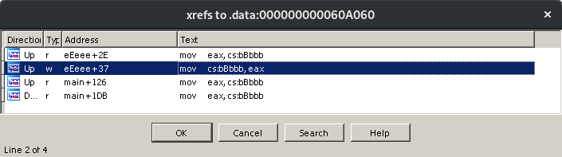

Setelah fungsi `main`, kita lihat salah satu fungsi `fFfff`, yaitu `fFfff20`

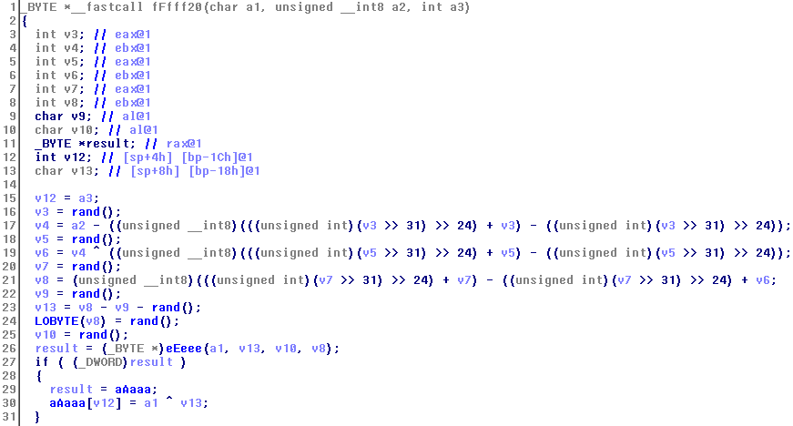

Jika kita bandingkan dengan line 22 pada `main`, maka kita tahu bahwa `a1` adalah `s[i]`, `a2` adalah `cCccc[i]` dan a3 adalah `i`. Instruksi pada line 26-31 dimiliki oleh semua fungsi yang berawalan `fFfff` dan berada di akhir fungsi. Jika diperhatikan lagi, `a1` hanya digunakan pada instruksi di line tersebut, yaitu saat pemanggilan fungsi `eEeee` dan perhitungan variabel `aAaaa`.

Pada line 30, karena `v13` merupakan `a3` yang berasal dari `i`, kita bisa menulis ulang menjadi `aAaaa[i] = s[i] ^ v13`. Menariknya, variabel `aAaaa` ini akan dixor kembali dengan `s` pada fungsi `main` (line 25). Karena `b ^ a ^ b == b`, maka bisa disimpulkan `aAaaa[i] = v13`. Jadi sekarang kita mencari cara agar `eEeee` mengembalikan nilai 1 agar variabel `aAaaa` dihitung

Di fungsi `eEeee`, jika argumen yang diberikan memenuhi syarat di line 5 pada gambar di bawah ini maka variabel `bBbbb` akan dikurangi satu dan fungsi akan mengembalikan nilai 1.

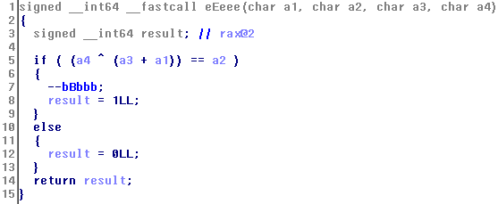

Fungsi `bBbbb` dinisiasi di awal dan bernilai 252, hanya dikurangi di fungsi `eEeee` dan sudah harus bernilai 0 setelah loop for pada `main` di line 19-23. Jadi inputan yang kita masukkan berupa string sepanjang 504 karakter yang terdiri dari `[0-9A-Fa-f]` dan `eEeee` harus mengembalikan nilai 1 agar `bBbbb` menjadi 0.

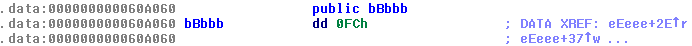

Jadi yang harus kita lakukan adalah mencari nilai a1 pada fungsi eEeee agar memenuhi `a4 ^ (a3 + a1) == a2` (yang sudah dicoba dan gagal) atau "memaksa" agar persyaratan tadi terpenuhi. Karena cara "paksa" lebih mudah dan pasti berhasil, maka disini hanya menjelaskan cara tersebut.

Kita lihat potongan assembly dari fungsi `eEeee`

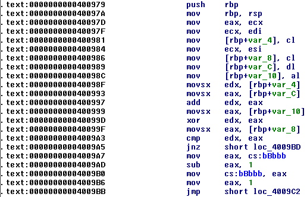

Pada address `0x4009A3`, instruksi `CMP` ini akan menentukan apakah `EDX` yang merupakan `a2` dan `EAX` yang merupakan hasil `a4 ^ (a3 + a1)` adalah sama. Kita bisa membuat `EDX` dan `EAX` selalu sama dengan memberi breakpoint pada address tersebut dan memberikan script di bawah ini:
```assembly
silent
set $eax=$edx
end
c
```
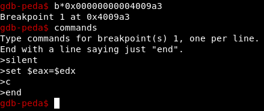

script tersebut akan membuat register `EAX` sama dengan `EDX` pada breakpoint. selanjutnya tinggal menjalankan program dan memasukkan string sepanjang 504 karakter.

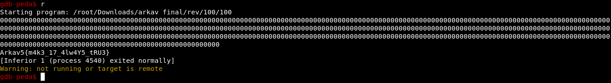
