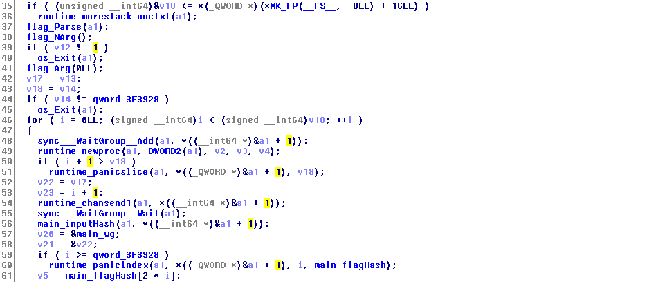
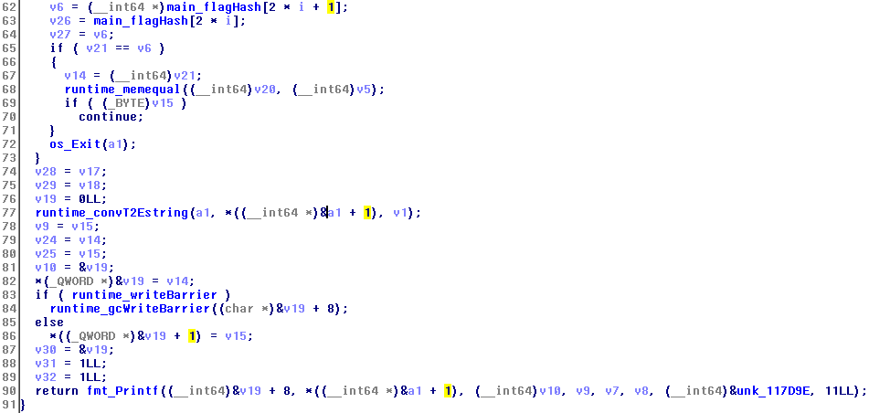
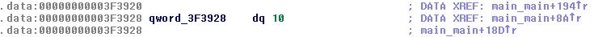
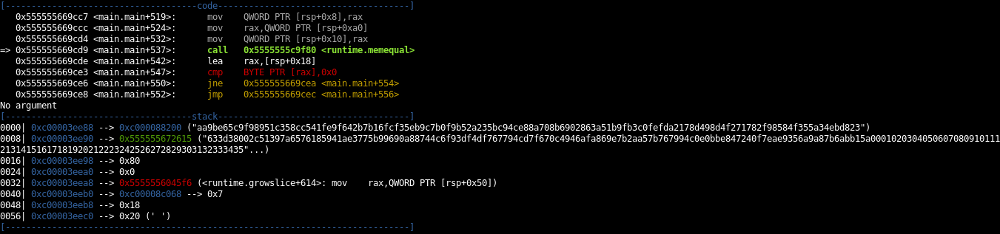
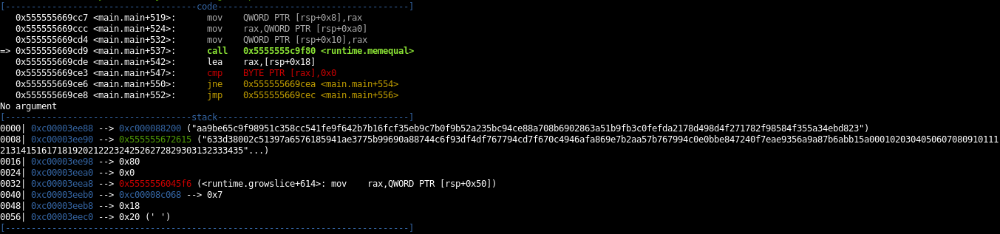
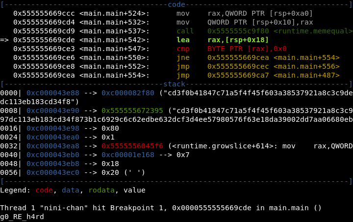
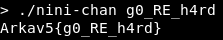

# nini-chan
Diberikan sebuah binary 64 bit bernama `nini-chan`. Dari deskripsi soal tersebut kita mendapat petunjuk kalau binary tersebut ditulis dalam bahasa **Go**. Setelah mencari-cari di internet, kami menemukan sebuah [website](https://rednaga.io/2016/09/21/reversing_go_binaries_like_a_pro/ "sumber ilmu") yang memberikan petunjuk untuk melakukan reversing pada binary tersebut.

Dari website tersebut, fungsi main akan bernama `main_main`. berikut merupakan potongan pseudocodenya




Pada line 36-39 terdapat pemanggilan fungsi `flag_Parse` dan `flag_NArg`. Berdasarkan [web ini](https://golang.org/pkg/flag/ "golang.org"), `flag_Parse` akan melakukan parsing terhadap command-line flag dan `flag_NArg` akan memberikan jumlah argumen yang tersisa. Setelah itu `v12` akan dicompare dengan 1. Jika tidak sama maka `os_Exit` akan dipangggil dan program akan berhenti. `v12` disini merupakan retrun value dari `flag_NArg`. Jadi program akan meminta inputan dari kita melalui argumen command line dan harus berjumlah satu.

Selanjutnya line 40-43, fungsi `flag_Arg` dipanggil lalu `v18` disamakan nilainya dengan `v14`. Kemudian `v14` dibandingkan dengan isi dari address `0x3F3928`. Jika tidak sama, maka `os_Exit` akan dipangggil. Dengan menggunakan gdb, `v14` yang berada pada `RSP+0x10` setelah fungsi  `flag_Arg` dipanggil berisi panjang string dari argumen pertama yang kita masukkan serta address `0x3F3928` berisi 10. Jadi, argumen kita harus sepanjang 10 karakter



Berikutnya, for loop dari line 48-75 yang akan melakukan iterasi dari 0 samapai 9. Kita langsung ke line 58 yang terdapat pemanggilan fungsi `main_inputHash`. Fungsi ini akan melakukan hashing terhadap suatu nilai dan hasilnya disimpan pada variabel `v22`. Pada line 65, `v8` akan diberi nilai berdasarkan array `main_hashFlag`. Array `main_hashFlag` berisi pointer-pointer string hasil hash yang terdapat pada `.rodata`. Lalu pada line 70, `runtime_memequal` akan dipanggil untuk membandingkan isi v22 dan v8. Jika tidak sama, maka program akan berhenti dengan memanggil `os_Exit`.

Lalu apakah yang dihasing oleh `main_inputHash`? Karena iterasi dimulai dari 0 sampai 9, kami menduga bahwa `main_inputHash` akan melakukan hasing per karakter dari argumen yang kita berikan. Kami melakukan percobaan dengan memberikan breakpoint saat fungsi `runtime_memequal` dipanggil dan membandingkan `v22` (yang terdapat pada register `RSP`) saat argumen yang kami berikan `1234567890` dan `1abcdefghi`.





Pada kedua gambar di atas, `RSP` berisi pointer yang memiliki nilai yang sama. berarti per karakter argumen yang kita berikan akan dihash dan hasilnya akan dibandingkan dengan array `main_hashFlag`.

Karena kami malas melihat algortima hashing yang digunakan, kami memutuskan untuk melakukan brute-force per karakter sampai fungsi `runtime_memequal` mengembalikan nilai 1. berikut script yang kami gunakan
```python
import gdb

gdb.execute("b *0x555555669cde")
a = "abcdefghijklmnopqrstuvwxyzABCDEFGHIJKLMNOPQRSTUVWXYZ1234567890_"
w = ['@']*10
cont = 0

for i in range(10):
    for x in a:            
        w[i]=x
        gdb.execute("r {0}".format("".join(w)))
        for _ in range(i):
            gdb.execute("c")
        d = gdb.execute("x/xb $rax",to_string=True)
        if("0x01" in d):
            cont += 1
            break
print("".join(w))
```
Script tersebut kemudian disimpan dalam sebuah file dan dijalankan dengan perintah `gdb ./nini-chan -x nama_file`.



Dan dicoba ke program...


